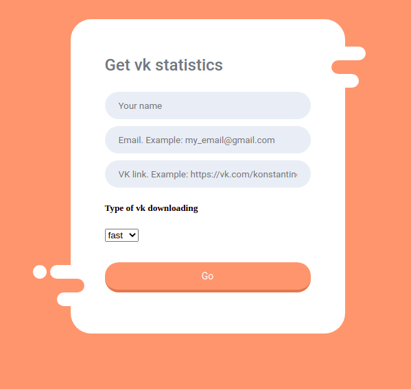

# Web project for analysing social network
This project was realized on Python with Flask library. It allows you to create a PDF file with some statistics about particular vk page (but this page should not be closed).<br>


### Instruction for running:
1. Install docker and docker-compose
2. Clone this repository
3. Fill a config file:
  * MAIL_USERNAME: name of your mail box without domen.
  * MAIL_PASSWORD: password of this mail box.
  * SECRET_KEY and WTF_CSRF_SECRET_KEY: some flags for FLASK-WTF (just google it).
  * ADMINS: your full name of mail box.
  * access_token: tokens for vk class (https://vkhost.github.io/). It is recommended to specify more than 2 tokens.

4. Build docker:
```console
user@user:~$ docker-compose up --build
```


#### Link: http://localhost:5555/

### Front page
<p align="left">
  
</p>

### Instruction for running project on Amazon AWS
* Create an account in a service
* Create public and private keys: my_key.pem
* After config your virtual machine, run next:
```console
user@user:~$ chmod 400 my_key.pem
user@user:~$ sudo ssh -i my_key.pem ec2-user@ec2-3-137-176-123.us-east-2.compute.amazonaws.com
user@user:~$ sudo yam install -y docker git
user@user:~$ docker-compose up --build
```

#### Link: http://ec2-3-137-176-123.us-east-2.compute.amazonaws.com:5555/
